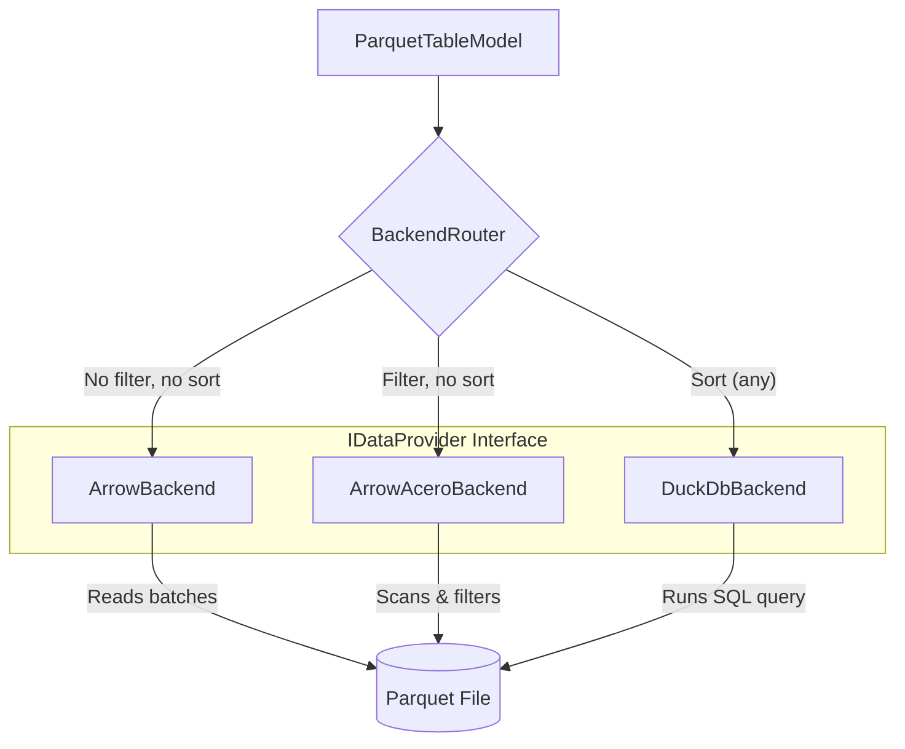

# Hybrid Backend Design for ParquetPad

## 1. Overview
This document outlines a hybrid backend architecture for filtering and sorting in ParquetPad. The goal is to combine the strengths of different technologies (Arrow, Acero, DuckDB) to provide optimal performance for various scenarios:
- **Fast sequential viewing**: For opening and scrolling through files without filters or sorts.
- **Efficient in-memory filtering**: For queries that only filter data.
- **Robust sorting**: For any query that requires sorting, which is resource-intensive.

## 2. High-Level Architecture
The core of the design is a `BackendRouter` that delegates data operations to one of three specialized backends, all implementing a common `IDataProvider` interface. The `ParquetTableModel` interacts with the router, remaining agnostic to the specific backend in use.

## 3. Core Components

- **`IDataProvider` (Interface)**: A new abstract C++ class defining the contract for data access. It will declare virtual methods for opening files, setting query parameters, fetching paged data, and retrieving the row count.

- **`Query` (Struct/Class)**: A plain data object representing the user's request, containing filter expressions and sort column descriptions.

- **`BackendRouter` (Class)**:
    - Owns instances of all three backend providers.
    - Contains the logic to select the appropriate backend based on the contents of the `Query` object.
    - Forwards calls from the `ParquetTableModel` to the currently active backend.

- **`ArrowBackend` (Class)**:
    - The default backend for simple sequential access (no filter, no sort).
    - Uses `arrow::parquet::ParquetFileReader` to read row groups sequentially.
    - Provides the fastest, lowest-overhead path for basic file viewing.
    - Row count is known immediately from file metadata.

- **`ArrowAceroBackend` (Class)**:
    - Activated when a filter is applied, but no sort is requested.
    - Uses `arrow::dataset::Dataset` and `arrow::dataset::Scanner`.
    - Builds an Acero filter expression to perform efficient, vectorized filtering.
    - Leverages Parquet statistics to skip row groups (predicate pushdown).
    - Row count is initially unknown and must be computed by scanning the dataset.

- **`DuckDbBackend` (Class)**:
    - Activated whenever a sort is requested (with or without a filter).
    - Manages an embedded DuckDB instance.
    - On query, it builds and executes a SQL string like `SELECT ... FROM read_parquet(...) WHERE ... ORDER BY ... LIMIT ... OFFSET ...`.
    - Handles large sorts by automatically spilling to disk.
    - Row count for a filtered set is determined by a background `COUNT(*)` query.

## 4. Data Flow and Logic

1.  **File Open**: The `ParquetTableModel` instructs the `BackendRouter` to open a file, which in turn opens it in all underlying backends. The `ArrowBackend` is set as active.
2.  **Query Change**: The user applies a filter or sort in the UI.
3.  **Routing**: The `ParquetTableModel` creates a `Query` object and passes it to the `BackendRouter`. The router inspects the query and selects the active backend:
    - `Query` is empty -> `ArrowBackend`.
    - `Query` has filters but no sort -> `ArrowAceroBackend`.
    - `Query` has a sort -> `DuckDbBackend`.
4.  **Data Fetching**: The table model requests pages of data from the `BackendRouter`. The router forwards the request to the active backend.
5.  **Paging**:
    - `ArrowBackend`: Reads the next chunk of row groups.
    - `ArrowAceroBackend`: Pulls the next `RecordBatch` from the filtered scanner.
    - `DuckDbBackend`: Re-queries with a new `OFFSET`. A stable sort order is enforced (e.g., by adding a tie-breaker column) to ensure consistent pages.
6.  **Asynchronous Operations**: All data fetching and row counting operations will be executed on a background thread to keep the UI responsive. The model will be notified of results via Qt's signal/slot mechanism.

## 5. File Structure
The implementation will introduce several new files into the `src/` directory:
- `Query.h`: Definition of the `Query` struct.
- `IDataProvider.h`: The abstract base class for backends.
- `BackendRouter.h` / `.cpp`: The router implementation.
- `ArrowBackend.h` / `.cpp`: The simple Arrow backend.
- `ArrowAceroBackend.h` / `.cpp`: The filter-only Acero backend.
- `DuckDbBackend.h` / `.cpp`: The sort-capable DuckDB backend.

The existing `ParquetTableModel.h` / `.cpp` will be modified to remove direct file access and instead use the `BackendRouter`.
